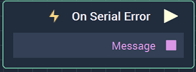
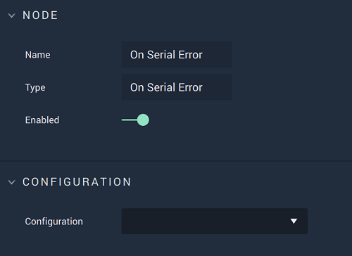

# Overview

The **On Serial Error Node** is an **Event Listener Node** that executes when an **Error** is received and returns the **Error** `Message`.

**Serial Communication** in **Incari** is available as a plugin and is enabled as default. However, in the case that it is disabled in the **Plugins Editor**, it will not appear in the **Project Settings**. Please refer to the [**Plugins Editor**](../../../modules/plugins-editor.md) to find out more information.

[**Scope**](../../overview.md#scopes): **Project**, **Scene**.

# Attributes

|Attribute|Type|Description|
|---|---|---|
|`Configuration`|**Drop-down**|The desired **Serial** connection.|

# Outputs

|Output|Type|Description|
|---|---|---|
|*Pulse Output* (►)|**Pulse**|A standard **Output Pulse**, to move onto the next **Node** along the **Logic Branch**, once this **Node** has finished its execution.|
|`Message`|**String**|The returned **Error** `Message`.|

# See Also

* [**On Serial Packet Receive**](onserialpacketreceive.md)
* [**On Serial Start**](onserialstart.md)
* [**On Serial Stop**](onserialstop.md)

