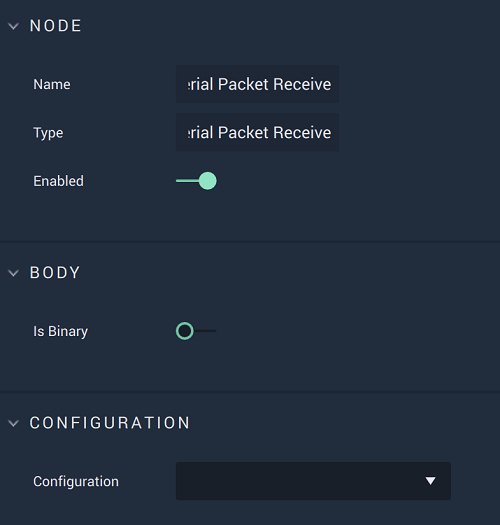

# Overview

The **On Serial Packet Receive Node** is an **Event Listener Node** that executes when a data **Packet** is received and returns its `Message`.

[**Scope**](../overview.md#scopes):
*  **Project**, **Scene**

# Attributes

|Attribute|Type|Description|
|---|---|---|
|`Is Binary`|**Bool**|Can be toggled on or off depending on if the `Message` body is binary or not.|
|`Configuration`|**Drop-down**|The desired **Serial** connection.|

# Outputs

|Output|Type|Description|
|---|---|---|
|*Pulse Output* (►)|**Pulse**|A standard **Output Pulse**, to move onto the next **Node** along the **Logic Branch**, once this **Node** has finished its execution.|
|`Message`|**String**|The returned `Message`.|

# See Also

* [**On Serial Error**](onserialerror.md)
* [**On Serial Start**](onserialstart.md)
* [**On Serial Stop**](onserialstop.md)

