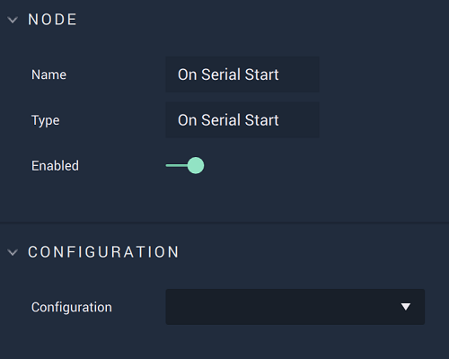

# Overview

The **On Serial Start Node** is an **Event Listener Node** notifying that the **Serial** connection was successfully established, therefore enabling the user to perform actions on said connection.

[**Scope**](../overview.md#scopes): **Project**, **Scene**.

# Attributes

|Attribute|Type|Description|
|---|---|---|
|`Configuration`|**Drop-down**|The desired **Serial** connection.|

# Outputs

|Output|Type|Description|
|---|---|---|
|*Pulse Output* (►)|**Pulse**|A standard **Output Pulse**, to move onto the next **Node** along the **Logic Branch**, once this **Node** has finished its execution.|

# See Also

* [**On Serial Error**](onserialerror.md)
* [**On Serial Packet Receive**](onserialpacketreceive.md)
* [**On Serial Stop**](onserialstop.md)

