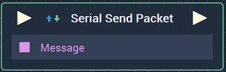
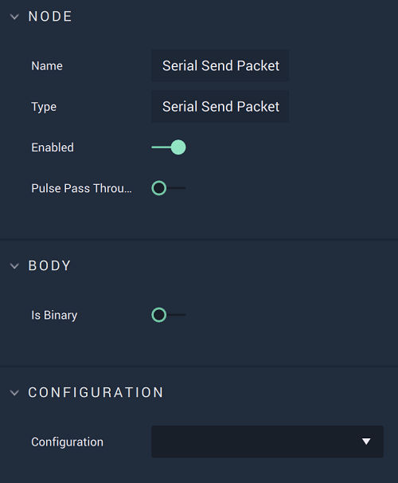

# Overview

The **Serial Send Packet Node** is used to send a data **Packet** after selecting a **Serial Communication** connection from the **Drop-down Menu**.

**Serial Communication** in **Incari** is available as a plugin and is enabled as default. However, in the case that it is disabled in the **Plugins Editor**, it will not appear in the **Project Settings**. Please refer to the [**Plugins Editor**](../../../modules/plugins-editor.md) to find out more information.

[**Scope**](../overview.md#scopes): **Project**, **Scene**, **Function**, **Prefab**.

# Attributes

|Attribute|Type|Description|
|---|---|---|
|`Is Binary`|**Bool**|Can be toggled on or off depending on if the `Message` body is binary or not.|
|`Configuration`|**Drop-down**|The desired **Serial** connection.|

# Inputs

|Input|Type|Description|
|---|---|---|
|*Pulse Input* (►)|**Pulse**|A standard **Input Pulse**, to trigger the execution of the **Node**.|
|`Message`|**String**|The **Packet's** `Message`.|

# Outputs

|Output|Type|Description|
|---|---|---|
|*Pulse Output* (►)|**Pulse**|A standard **Output Pulse**, to move onto the next **Node** along the **Logic Branch**, once this **Node** has finished its execution.|

# See Also
* [**Serial Start**](serialstart.md)
* [**Serial Stop**](serialstop.md)
  
