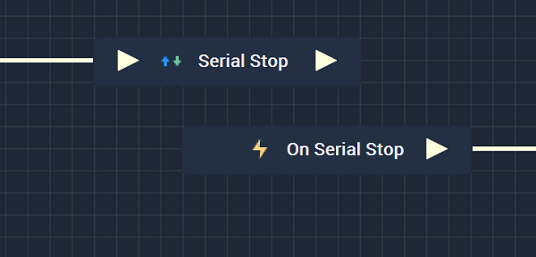
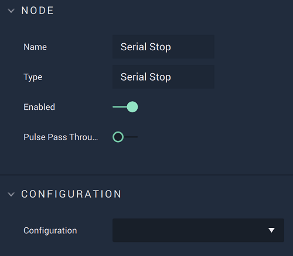

# Overview

The **Serial Stop Node** stops the **Serial** connection.

It is important to note that while the **Serial Stop Node** stops a **Serial** connection, it may not completely finish disconnecting from said connection when the **Node** is executed. This could lead to the **Logic** attached to its **Output Pulse** 
to not work even though there is technically nothing wrong. In order to avoid this, it is highly suggested to use 
the [**On Serial Stop Node**](events/onserialstop.md) instead. This way, the **Logic** will only execute once the **Serial** connection has definitely been disconnected from. This way, it is assured that the **Logic** will execute once the connection to the **Serial** connection has been terminated.

Again, the user must first use the **Serial Stop Node** to close the connection. Separately, the **On Serial Stop Node** can be used to execute the desired **Communication Logic**.  

[**Scope**](../overview.md#scopes): **Project**, **Scene**, **Function**, **Prefab**.

# Attributes

|Attribute|Type|Description|
|---|---|---|
|`Configuration`|**Drop-down**|The desired **Serial** connection.|

# Inputs

|Input|Type|Description|
|---|---|---|
|*Pulse Input* (►)|**Pulse**|A standard **Input Pulse**, to trigger the execution of the **Node**.|

# Outputs

|Output|Type|Description|
|---|---|---|
|*Pulse Output* (►)|**Pulse**|A standard **Output Pulse**, to move onto the next **Node** along the **Logic Branch**, once this **Node** has finished its execution.|

# See Also

* [**Serial Send Packet**](serialsendpacket.md)
* [**Serial Start**](serialstart.md)

