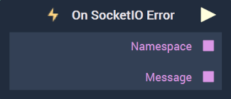
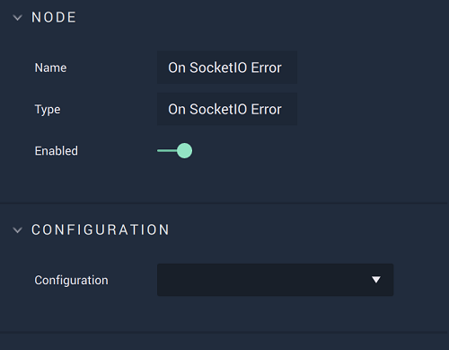

# Overview

**On SocketIO Error** is an **Event Listener Node** that executes when an **Error** is received and returns the **Error** `Message`.

[**Scope**](../../overview.md#scopes): **Project**, **Scene**.

# Attributes

|Attribute|Type|Description|
|---|---|---|
|`Configuration`|**Drop-Down**|The desired _SocketIO_ server, which refers back to the selections made under *SocketIO* in the [**Project Settings**](../../../modules/project-settings.md).| 

# Outputs

|Output|Type|Description|
|---|---|---|
|*Pulse Output* (►)|**Pulse**|A standard **Output Pulse**, to move onto the next **Node** along the **Logic Branch**, once this **Node** has finished its execution.|
|`Namespace`|**String**|An identifying name that is *parent* to an event or events in the **SocketIO** protocol. The default is simply `/`.|
|`Message`|**String**|The returned **Error** `Message`.|

