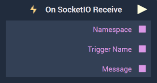

# Overview

**On SocketIO Receive** is an **Event Listener Node** that executes and triggers a **Logic Branch** when data of a **SocketIO** event is received and returns its `Message`, name, and `Namespace`.

**SocketIO Communication** in **Incari** is available as a plugin and is enabled as default. However, in the case that it is disabled in the **Plugins Editor**, it will not appear in the **Project Settings** and **On SocketIO Receive** will not show up in the [**Toolbox**](../../overview.md). Please refer to the [**Plugins Editor**](../../../modules/plugins/README.md) to find out more information.

[**Scope**](../../overview.md#scopes): **Project**, **Scene**.

# Attributes

|Attribute|Type|Description|
|---|---|---|
|`Configuration`|**Drop-Down**|The desired _SocketIO_ server, which refers back to the selections made under *SocketIO* in the [**Project Settings**](../../../modules/project-settings.md).| 

# Outputs

|Output|Type|Description|
|---|---|---|
|*Pulse Output* (►)|**Pulse**|A standard **Output Pulse**, to move onto the next **Node** along the **Logic Branch**, once this **Node** has finished its execution.|
|`Namespace`|**String**| An identifying name that is *parent* to an event or events in the **SocketIO** protocol. The default is simply `/`.|
|`Trigger Name`|**String**| The name of the event.|
|`Message`|**String**| The returned `Message`.|

