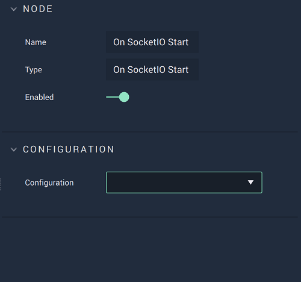

# Overview

**On SocketIO Start** is an **Event Listener Node** notifying that the **SocketIO** connection was successfully established, therefore enabling the user to trigger a **Logic Branch** on said connection to the *SocketIO* server.

**SocketIO Communication** in **Incari** is available as a plugin and is enabled as default. However, in the case that it is disabled in the **Plugins Editor**, it will not appear in the **Project Settings** and **On SocketIO Start** will not show up in the [**Toolbox**](../../overview.md). Please refer to the [**Plugins Editor**](../../../modules/plugins/README.md) to find out more information.

[**Scope**](../../overview.md#scopes): **Project**, **Scene**.

# Attributes

|Attribute|Type|Description|
|---|---|---|
|`Configuration`|**Drop-Down**|The desired _SocketIO_ server, which refers back to the selections made under *SocketIO* in the [**Project Settings**](../../../modules/project-settings.md).| 

# Outputs

|Output|Type|Description|
|---|---|---|
|*Pulse Output* (►)|**Pulse**|A standard **Output Pulse**, to move onto the next **Node** along the **Logic Branch**, once this **Node** has finished its execution.|

# See Also

* [**On SocketIO Stop**](onsocketiostop.md)

