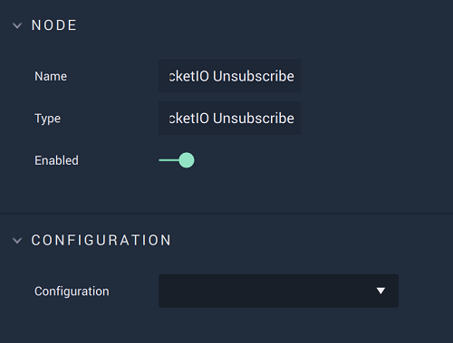

# Overview

**On Socket.IO Unsubscribe** is an **Event Listener Node** allowing the user to trigger a **Logic Branch** once a **Socket.IO** event has been unsubscribed from. 

**Socket.IO Communication** in **Incari** is available as a plugin and is enabled as default. However, in the case that it is disabled in the **Plugins Editor**, it will not appear in the **Project Settings** and **On Socket.IO Unsubscribe** will not show up in the [**Toolbox**](../../overview.md). Please refer to the [**Plugins Editor**](../../../../modules/plugins/README.md) to find out more information.

[**Scope**](../../overview.md#scopes): **Project**, **Scene**.

# Attributes

|Attribute|Type|Description|
|---|---|---|
|`Configuration`|**Drop-Down**|The desired _Socket.IO_ server, which refers back to the selections made under *Socket.IO* in the [**Project Settings**](../../../../modules/project-settings/socketio.md).| 

# Outputs

|Output|Type|Description|
|---|---|---|
|*Pulse Output* (►)|**Pulse**|A standard **Output Pulse**, to move onto the next **Node** along the **Logic Branch**, once this **Node** has finished its execution.|
|`Namespace`|**String**| An identifying name that is *parent* to an event or events in the **Socket.IO** protocol. The default is simply `/`.|
# See Also

* [**Socket.IO Unsubscribe**](../socketiounsubscribe.md)
* [**On Socket.IO Subscribe**](onsocketiosubscribe.md)

