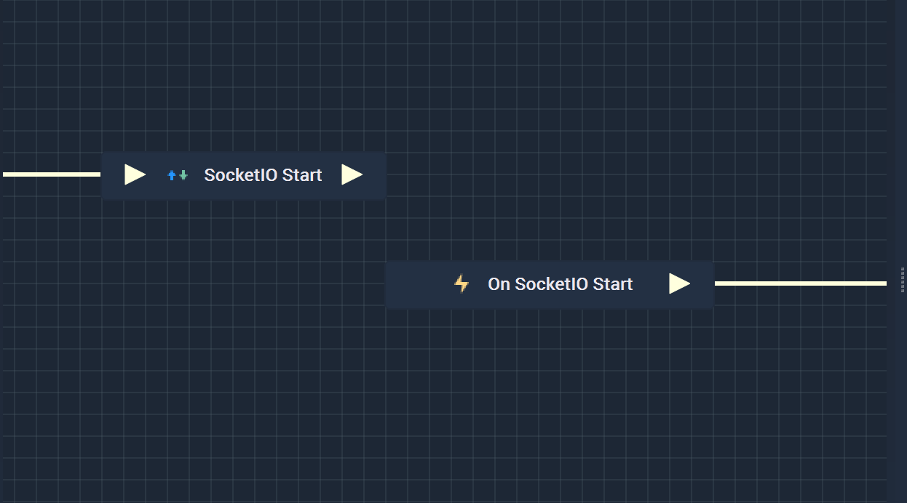
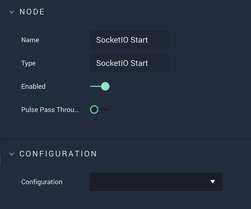

# Overview

The **SocketIO Start Node** starts a **SocketIO** connection that has already been set up in [**Project Settings**](../../../modules/project-settings.md#serial).

**SocketIO Communication** in **Incari** is available as a plugin and is enabled as default. However, in the case that it is disabled in the **Plugins Editor**, it will not appear in the **Project Settings** and **SocketIO Start** will not show up in the [**Toolbox**](../../overview.md). Please refer to the [**Plugins Editor**](../../../modules/plugins/README.md) to find out more information.

It is important to note that while the **SocketIO Start Node** starts a **SocketIO** connection, it may not completely finish establishing
said connection when the **Node** is executed. This could lead to the **Logic** attached to its **Output Pulse** 
to not work even though there is technically nothing wrong. In order to avoid this, it is highly suggested to use 
the [**On SocketIO Start Node**](events/onsocketiostart.md) instead. This way, the **Logic** will only execute once the **SocketIO** connection has definitely been established. 

Again, the user must first use the **SocketIO Start Node** to open the connection. Separately, the **On SocketIO Start Node** can be used to execute the desired **Communication Logic**.

.

[**Scope**](../overview.md#scopes): **Project**, **Scene**, **Function**, **Prefab**.

# Attributes

|Attribute|Type|Description|
|---|---|---|
|`Configuration`|**Drop-Down**|The desired _SocketIO_ server, which refers back to the selections made under *SocketIO* in the [**Project Settings**](../../../modules/project-settings.md).| 

# Inputs

|Input|Type|Description|
|---|---|---|
|*Pulse Input* (►)|**Pulse**|A standard **Input Pulse**, to trigger the execution of the **Node**.|

# Outputs

|Output|Type|Description|
|---|---|---|
|*Pulse Output* (►)|**Pulse**|A standard **Output Pulse**, to move onto the next **Node** along the **Logic Branch**, once this **Node** has finished its execution.|

# See Also

* [**On SocketIO Start**](events/onsocketiostart.md)
* [**SocketIO Stop**](socketiostop.md)

