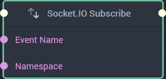
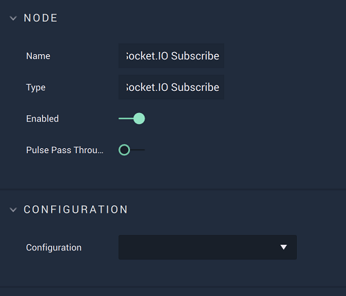

# Overview

The **Socket.IO Subscribe Node** starts listening to the specific **Socket.IO** event given. This means that the server filters for the desired data with the particular `Namespace` and `Event name`.

**Socket.IO Communication** in **Incari** is available as a plugin and is enabled as default. However, in the case that it is disabled in the **Plugins Editor**, it will not appear in the **Project Settings** and **Socket.IO Subscribe** will not show up in the [**Toolbox**](../../overview.md). Please refer to the [**Plugins Editor**](../../../modules/plugins/communication/socketiomanager.md) to find out more information.

[**Scope**](../overview.md#scopes): **Project**, **Scene**.

# Attributes

|Attribute|Type|Description|
|---|---|---|
|`Configuration`|**Drop-Down**|The desired _Socket.IO_ server, which refers back to the selections made under *Socket.IO* in the [**Project Settings**](../../../modules/project-settings/socketio.md).| 

# Inputs

|Input|Type|Description|
|---|---|---|
|*Pulse Input* (►)|**Pulse**|A standard **Input Pulse**, to trigger the execution of the **Node**.|
|`Event Name`|**String**|The identifying name of the **Socket.IO** event.|
|`Namespace`|**String**| An identifying name that is *parent* to an event or events in the **Socket.IO** protocol. The default is simply `/`.|

# Outputs

|Output|Type|Description|
|---|---|---|
|*Pulse Output* (►)|**Pulse**|A standard **Output Pulse**, to move onto the next **Node** along the **Logic Branch**, once this **Node** has finished its execution.|

# See Also

* [**Socket.IO Unsubscribe**](socketiounsubscribe.md)

