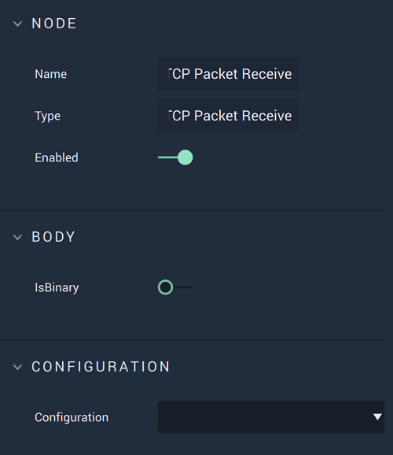

# Overview

**On TCP Packet Receive** is an **Event Listener Node** that listens to an established **TCP** connection and outputs the `Message` data given, therefore enabling the user to trigger a **Logic Branch** when the `Message` is received. 

[**Scope**](../../overview.md#scopes): **Project**, **Scene**.

# Attributes

|Attribute|Type|Description|
|---|---|---|
|`Is Binary`|**Bool**|Can be toggled on or off depending on if the `Message` body is binary or not.|
|`Configuration`|**Drop-Down**|The desired _TCP_ server, which refers back to the selections made under *TCP* in the [**Project Settings**](../../../modules/project-settings.md).| 

# Outputs

|Output|Type|Description|
|---|---|---|
|*Pulse Output* (►)|**Pulse**|A standard **Output Pulse**, to move onto the next **Node** along the **Logic Branch**, once this **Node** has finished its execution.|
|`Message`|**String**|The returned `Message`.|

