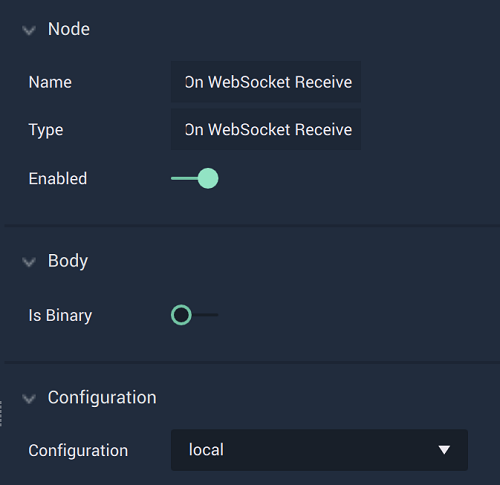

# Overview

The **On WebSocket Receive Node** is an **Event Listener Node** that is triggered if the *Websocket* connection received a message during any action for the selected configuration, which was established in the [**Project Settings**](../../../../modules/project-settings/websocket.md).

**WebSocket Communication** in **Incari** is available as a plugin and is enabled as default. However, in the case that it is disabled in the **Plugins Editor**, it will not appear in the **Project Settings** and **On WebSocket Receive** will not show up in the [**Toolbox**](../../../overview.md). Please refer to the [**Plugins Editor**](../../../../modules/plugins/README.md) to find out more information.

[**Scope**](../overview.md#scopes): **Project**, **Scene**.

# Attributes

|Attribute|Type|Description|
|---|---|---|
|`Is Binary`|**Bool**|A boolean which allows the user to choose whether the returned message is in **String** or binary format. If it is toggled on (*true*), it will be **Binary**. If off (*false*), it will be a **String**.|
|`Configuration`|**Dropdown**|The identifying connection name that will be used, which is one that was set up in the [**Project Settings**](../../../modules/project-settings/websocket.md).|

# Outputs

|Output|Type|Description|
|---|---|---|
|*Pulse Output* (►)|**Pulse**|A standard **Output Pulse**, to move onto the next **Node** along the **Logic Branch**, once this **Node** has finished its execution.|
|`Message`|**String** or **Bool**|The message data in **String** format, unless `Is Binary` was set to true (resulting in a message in **Binary** format).|

# See Also

* [**On WebSocket Error**](onwebsocketerror.md)
* [**On WebSocket Start**](onwebsocketstart.md)
* [**On WebSocket Stop**](onwebsocketstop.md)

