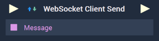
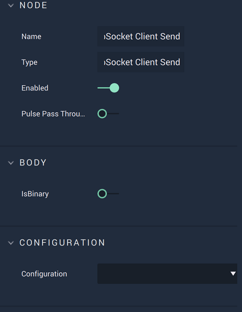

# Overview

The **WebSocket Client Send Node** sends a message via the open *WebSocket* connection specified in `Configuration`.

**WebSocket Communication** in **Incari** is available as a plugin and is enabled as default. However, in the case that it is disabled in the **Plugins Editor**, it will not appear in the **Project Settings** and **WebSocket Client Send** will not show up in the [**Toolbox**](../../overview.md). Please refer to the [**Plugins Editor**](../../../modules/plugins/README.md) to find out more information.

[**Scope**](../overview.md#scopes): **Project**, **Scene**.

# Attributes

|Attribute|Type|Description|
|---|---|---|
|`Is Binary`|**Bool**|A boolean which allows the user to choose whether the returned message is in **String** or binary format. If it is toggled on (*true*), it will be **Binary**. If off (*false*), it will be a **String**.|
|`Configuration`|**Dropdown**|The identifying connection name that will be used, which is one that was set up in the [**Project Settings**](../../../modules/project-settings/websocket.md).|

# Inputs

|Input|Type|Description|
|---|---|---|
|*Pulse Input* (►)|**Pulse**|A standard **Input Pulse**, to trigger the execution of the **Node**.|
|`Message`|**String**|The desired message to be sent through the chosen *WebSocket* connection. If `IsBinary`is toggled off, it will remain a **String**. If it is toggled on, it will be in **Binary** format.|

# Outputs

|Output|Type|Description|
|---|---|---|
|*Pulse Output* (►)|**Pulse**|A standard **Output Pulse**, to move onto the next **Node** along the **Logic Branch**, once this **Node** has finished its execution.|

# See Also

* [**WebSocket Client Start**](websocketstart.md)
* [**WebSocket Client Stop**](websocketstop.md)
  

