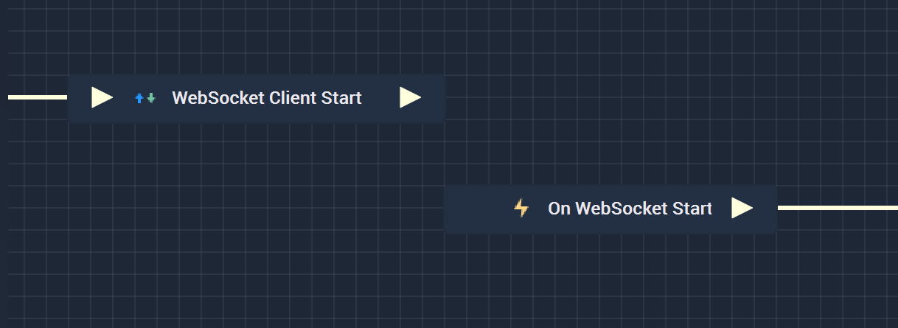
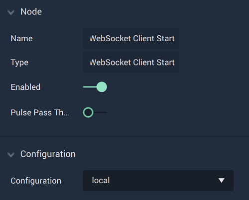

# Overview

The **WebSocket Client Start Node** starts the *WebSocket* connection based on the configuration that has already been set up in the [**Project Settings**](../../../modules/project-settings/websocket.md).

**WebSocket Communication** in **Incari** is available as a plugin and is enabled as default. However, in the case that it is disabled in the **Plugins Editor**, it will not appear in the **Project Settings** and **WebSocket Client Start** will not show up in the [**Toolbox**](../../overview.md). Please refer to the [**Plugins Editor**](../../../modules/plugins/README.md) to find out more information.

It is important to note that while the **WebSocket Client Start Node** starts a **WebSocket** connection, it may not completely finish establishing said connection when the **Node** is executed. This could lead to the **Logic** attached to its **Output Pulse** to not work even though there is technically nothing wrong. In order to avoid this, it is highly suggested to use the [**On WebSocket Start Node**](events/onwebsocketstart.md) instead. This way, the **Logic** will only execute once the **WebSocket** connection has definitely been established.

Again, the user must first use the **WebSocket Client Start Node** to open the connection. Separately, the **On WebSocket Start Node** can be used to execute the desired **Communication Logic**.

[**Scope**](../../overview.md#scopes): **Project**, **Scene**.

# Attributes

|Attribute|Type|Description|
|---|---|---|
|`Configuration`|**Dropdown**|The identifying connection name that will be used, which is one that was set up in the [**Project Settings**](../../../modules/project-settings/websocket.md).|

# Inputs

|Input|Type|Description|
|---|---|---|
|*Pulse Input* (►)|**Pulse**|A standard **Input Pulse**, to trigger the execution of the **Node**.|

# Outputs

|Output|Type|Description|
|---|---|---|
|*Pulse Output* (►)|**Pulse**|A standard **Output Pulse**, to move onto the next **Node** along the **Logic Branch**, once this **Node** has finished its execution.|

# See Also

* [**On WebSocket Start**](events/onwebsocketstart.md)
* [**WebSocket Client Send**](websocketsend.md)
* [**WebSocket Client Stop**](websocketstop.md)

