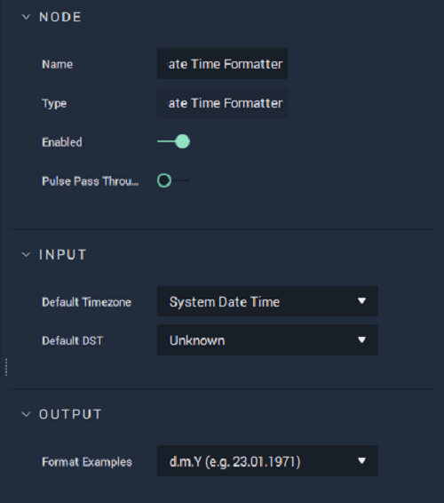

# Date Time Formatter

## Overview

**Date Time Formatter** outputs a _date_ and/or _time_ in a specified format. By using a combination of special _format characters_, many different date/time formats can be created. This is used mostly for localization, however, it could also be used for formatting based on user preferences.

For more information about _formatting strings_, please see the external links at the [bottom of this page](date-time-formatter.md#external-links).

[**Scope**](../overview.md#scopes): **Project**, **Scene**, **Function**, **Prefab**.

## Attributes

### Input

| Attribute | Type | Description |
| :--- | :--- | :--- |
| `Default Timezone` | **Drop-down** | The timezone that will be used, which is an offset of the UTC. |
| `Default DST` | **Drop-down** | Determines whether or not Daylight Savings Time is taken into account. |

### Output

| Attribute | Type | Description |
| :--- | :--- | :--- |
| `Format Examples` | **Drop-down** | A selection of pre-defined formats. By selecting `Custom`, you can create a custom _formatting string_. |
| `Custom Format` | **String** | The _formatting string_ which will determine how the date and/or time is represented. |

## Inputs

| Input | Type | Description |
| :--- | :--- | :--- |
| _Pulse Input_ \(►\) | **Pulse** | A standard input **Pulse**, to trigger the execution of the **Node**. |
| `UTC Unix (ms)` | **Int** | The UTC in Unix format. |
| `Timezone Offset (ms)` | **Int** | The time offset in milliseconds. |
| `DST` | **Bool** | Determines whether or not Daylight Savings Time is taken into account. |
| `Format` | **String** | The _formatting string_ which will determine how the date and/or time is represented. |

## Outputs

| Output | Type | Description |
| :--- | :--- | :--- |
| _Pulse Output_ \(►\) | **Pulse** | A standard output **Pulse**, to move onto the next **Node** along the **Logic Branch**, once this **Node** has finished its execution. |
| `Output` | **String** | The formatted date/time. |

## See Also

* [**DateTime**](./)
* [**Timezone Value**](timezone-value.md)
* [**Now \(UTC\)**](https://docs.incari.com/incari-studio/toolbox/datetime/now-utc)

## External Links

* [_Formatting Date and Time_](https://wordpress.org/support/article/formatting-date-and-time/) on WordPress.org.
* [_PHP: date - Manual_](https://www.php.net/manual/en/function.date.php) on PHP.net.
* [_UTC - The World's Time Standard_](https://www.timeanddate.com/time/aboututc.html) on timeanddate.com.

