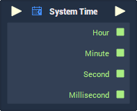

# Overview

**System Time** is used for returning different individual parts of the current system time at the moment that the **Node** is evaluated. Values are returned as **Integers** or **Floats**, and therefore, have no inherent zero-padding, textual notation or suffixes.

When `Smooth float value` is enabled, the output values won't be rounded down, so if the current time is 1:45, the `Hour` output will be ~1.75.

# Attributes

|Attribute|Type|Description|
|---|---|---|
|`Mode`|**Drop-down**|Determines whether the `Hour` value will be returned in 12-hour or 24-hour format.|
|`Smooth float value`|**Bool**|Determines whether the output values will be rounded down (**Int**) or not (**Float**).|

# Inputs

|Input|Type|Description|
|---|---|---|
|*Pulse Input* (►)|**Pulse**|A standard input **Pulse**, to trigger the execution of the **Node**.|

# Outputs

|Output|Type|Description|
|---|---|---|
|*Pulse Output* (►)|**Pulse**|A standard output **Pulse**, to move onto the next **Node** along the *logic branch*, once this **Node** has finished its execution.|
|`Hour`|**Int** or **Float** (*Determined by the* `Mode` ***Attribute***).|The hour according to the system's current time.|
|`Minute`|**Int** or **Float** (*Determined by the* `Mode` ***Attribute***).|The minute according to the system's current time.|
|`Second`|**Int** or **Float** (*Determined by the* `Mode` ***Attribute***).|The second according to the system's current time.|
|`Millisecond`|**Int** or **Float** (*Determined by the* `Mode` ***Attribute***).|The millisecond according to the system's current time.|

# See Also

- [**DateTime**](README.md)