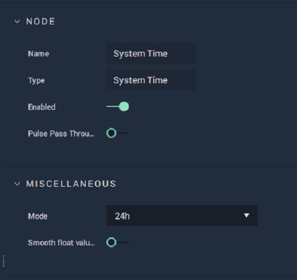

# System Time

## Overview

**System Time** is used for returning different individual parts of the current system time at the moment that the **Node** is evaluated. Values are returned as **Integers, Floats**, or **Vector3** and therefore have no inherent zero-padding, textual notation, or suffixes.

When `Smooth float value` is enabled, the output values won't be rounded down, so if the current time is 1:45, the `Hour` output will be ~1.75.

## Attributes

| Attribute | Type | Description |
| :--- | :--- | :--- |
| `Mode` | **Drop-down** | Determines whether the `Hour` value will be returned in 12-hour, 24-hour or degree format. |
| `Smooth float value` | **Bool** | Determines whether the output values will be rounded down \(**Int**\) or not \(**Float**\). |

## Inputs

| Input | Type | Description |
| :--- | :--- | :--- |
| _Pulse Input_ \(►\) | **Pulse** | A standard input **Pulse**, to trigger the execution of the **Node**. |

## Outputs

| Output | Type                | Description |
| :--- | :--- | :--- |
| _Pulse Output_ \(►\) | **Pulse** | A standard output **Pulse**, to move onto the next **Node** along the **Logic Branch**, once this **Node** has finished its execution. |
| `Hour` | **Int**, **Float**, or **Vector3** \(_Determined by the_ `Mode` _**Attribute**_\). | The hour according to the system's current time. |
| `Minute` | **Int**, **Float**, or **Vector3**  \(_Determined by the_ `Mode` _**Attribute**_\). | The minute according to the system's current time. |
| `Second` | **Int**, **Float**, or **Vector3**  \(_Determined by the_ `Mode` _**Attribute**_\). | The second according to the system's current time. |
| `Millisecond` | **Int**, **Float**, or **Vector3**  \(_Determined by the_ `Mode` _**Attribute**_\). | The millisecond according to the system's current time. |

## See Also

* [**DateTime**](./)

