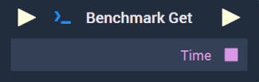
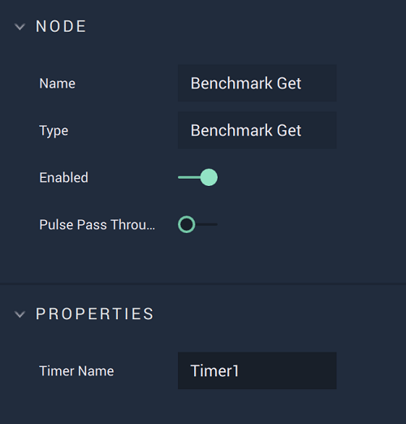

# Benchmark Get

## Overview

The **Benchmark Get** **Node** retrieves the time on a timer. When it is executed, it prints the time on the **Console** and outputs the value in milliseconds as a **String**.

[**Scope**](../overview.md#scopes): **Project**, **Scene**, **Function**, **Prefab**.

## Attributes

| Attribute | Type | Description |
| :--- | :--- | :--- |
| `Timer Name` | **String** | The name of the timer from which the time will be retrieved. |

## Inputs

| Input | Type | Description |
| :--- | :--- | :--- |
| _Pulse Input_ \(►\) | **Pulse** | A standard **Input Pulse**, to trigger the execution of the **Node**. |

## Outputs

| Output | Type | Description |
| :--- | :--- | :--- |
| _Pulse Output_ \(►\) | **Pulse** | A standard **Output Pulse**, to move onto the next **Node** along the **Logic Branch**, once this **Node** has finished its execution. |
| `Time` | **String** | The time on the timer in milliseconds. |

## See Also

* [**Benchmark Start**](benchmark-start.md)
* [**Benchmark Stop**](benchmark-stop.md)

