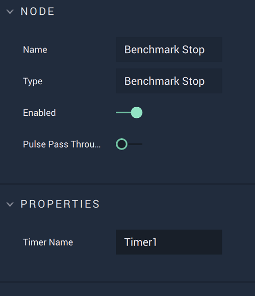

# Benchmark Stop

## Overview

The **Benchmark Stop** **Node** stops a timer and prints the time measured on the **Console**.

## Attributes

| Attribute | Type | Description |
| :--- | :--- | :--- |
| `Timer Name` | **String** | The name of the timer that the **Node** stops. |

## Inputs

| Input | Type | Description |
| :--- | :--- | :--- |
| _Pulse Input_ \(►\) | **Pulse** | A standard **Input Pulse**, to trigger the execution of the **Node**. |

## Outputs

| Output | Type | Description |
| :--- | :--- | :--- |
| _Pulse Output_ \(►\) | **Pulse** | A standard **Output Pulse**, to move onto the next **Node** along the **Logic Branch**, once this **Node** has finished its execution. |

## See Also

* [**Benchmark Start**](benchmark-start.md)
* [**Benchmark Get**](benchmark-get.md)

