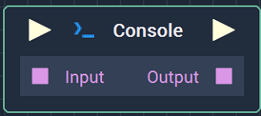
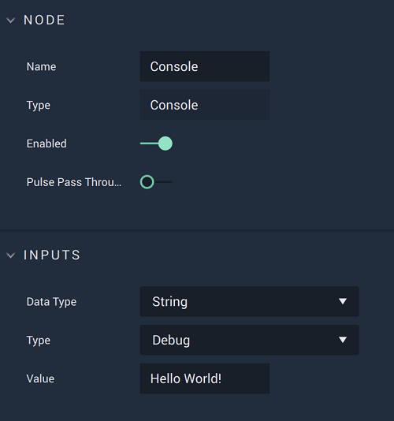

# Console

## Overview

The **Console** **Node** is used for showing a value of any **Data Type** on the **Console**.

[**Scope**](../overview.md#scopes):
*  **Project**, **Scene**, **Function**, **Prefab**

## Attributes

### Inputs

| Attribute | Type | Description |
| :--- | :--- | :--- |
| `Data Type` | **Drop-down** | **Data Type** of the `Input` and `Output` **Sockets**. |
| `Type` | **Drop-down** | Type of the message that will appear on the **Console**. |
| `Value` | _Defined in the `Data Type` **Attribute**_ | Default value, if none is received in the `Input` **Socket**. |

## Inputs

| Input | Type | Description |
| :--- | :--- | :--- |
| _Pulse Input_ \(►\) | **Pulse** | A standard **Input Pulse**, to trigger the execution of the **Node**. |
| `Input` | _Defined in the `Data Type` **Attribute**_ | Value that will be shown on the **Console**. |

## Outputs

| Output | Type | Description |
| :--- | :--- | :--- |
| _Pulse Output_ \(►\) | **Pulse** | A standard **Output Pulse**, to move onto the next **Node** along the **Logic Branch**, once this **Node** has finished its execution. |
| `Output` | _Defined in the `Data Type` **Attribute**_ | Value that was shown on the **Console**. |

## See Also

* [**Clear Console**](clear-console.md)

