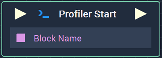
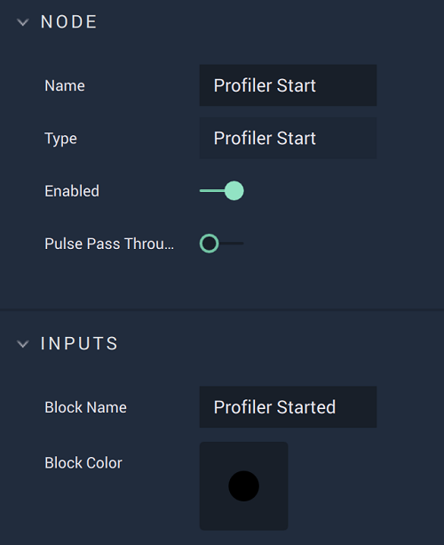

# Profiler Start

## Overview

The **Profiler Start** **Node** marks the start of a **Profiler Block** that will be analyzed in the **Profiler View**.

[**Scope**](../overview.md#scopes):
*  **Project**, **Scene**, **Function**, **Prefab**

## Attributes

| Attribute | Type | Description |
| :--- | :--- | :--- |
| `Block Name` | **String** | Default name the block will have in the **Profiler View**, if none is given in the **Input** **Socket**. |
| `Block Color` | **Color** | Color the block will have in the **Profiler View**. |

## Inputs

| Input | Type | Description |
| :--- | :--- | :--- |
| _Pulse Input_ \(►\) | **Pulse** | A standard **Input Pulse**, to trigger the execution of the **Node**. |
| `Block Name` | **String** | Name the block will have in the **Profiler View**. |

## Outputs

| Output | Type | Description |
| :--- | :--- | :--- |
| _Pulse Output_ \(►\) | **Pulse** | A standard **Output Pulse**, to move onto the next **Node** along the **Logic Branch**, once this **Node** has finished its execution. |

## See Also

* [**Profiler Stop**](profiler-stop.md)
* [**Profiler View**](../../modules/profiler-view.md)

