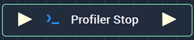

# Profiler Stop

## Overview

The **Profiler Stop** **Node** marks the end of a **Profiler Block** that will be analyzed in the **Profiler View**.

## Inputs

| Input | Type | Description |
| :--- | :--- | :--- |
| _Pulse Input_ \(►\) | **Pulse** | A standard **Input Pulse**, to trigger the execution of the **Node**. |

## Outputs

| Output | Type | Description |
| :--- | :--- | :--- |
| _Pulse Output_ \(►\) | **Pulse** | A standard **Output Pulse**, to move onto the next **Node** along the **Logic Branch**, once this **Node** has finished its execution. |

## See Also

* [**Profiler Start**](profiler-start.md)
* [**Profiler View**](../../modules/profiler-view.md)

