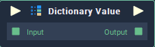

# Dictionary Value

## Overview

The **Dictionary Value** node defines a **Dictionary** by setting its _(key, value)_ pairings.

## Attributes

### Inputs

#### Inputs

The number of **Input** elements you wish to add to the **Attribute section**. Each **Input** element represents a _(key, value)_ pair that is added to the **Dictionary Value** **Node**. The pairs in this section are used if no pairs are provided to the **Input** **Node**. The format of the section is as follows:

| Attribute | Type | Description |
| :--- | :--- | :--- |
| `Key` | **String** | The `Key` you wish to add to the **Dictionary Value** **Node**. |
| `Value Type` | **Drop Down**  | The `Data Type` of the `Value` that you wish to add to the **Dictionary Value** **Node**. |
| `Value` | _Defined in the_ `Data Type` _**Attribute**_.  | The `Value` you wish to give to the `Key` introduced above. |

## Inputs

| Input | Type | Description |
| :--- | :--- | :--- |
| _Pulse Input_ \(►\) | **Pulse** | A standard **Input Pulse**, to trigger the execution of the **Node**. |
| `Input` | **Dictionary** | A **Dictionary** you wish to add to the **Dictionary Value** **Node**.  |

## Outputs

| Output | Type | Description |
| :--- | :--- | :--- |
| _Pulse Output_ \(►\) | **Pulse** | A standard **Output Pulse**, to move onto the next **Node** along the **Logic Branch**, once this **Node** has finished its execution. |
| `Output` | **Dictionary** | The **Dictionary** holding the (`Key`, `Value`) pairs that were added to the **Dictionary Value** **Node**. |

## See Also

* [**Clear Dictionary**](clear-dictionary.md)

