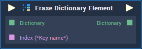

# Erase Dictionary Element

## Overview

The **Erase Dictionary Element** removes an element or more of a **Dictionary**. It receives as input the **Dictionary** from which the element/s will be removed and the `key/s` of the element/s to erase.

## Attributes

### Inputs

`Inputs` - The number of elements you wish to remove from the **Input** **Dictionary**. Each element has the following **Attribute**:

| Attribute | Type | Description |
| :--- | :--- | :--- |
| `Key` | **String** | The `Key` of the element you wish to remove if none is given in the **Input** **Socket**. |

## Inputs

| Input | Type | Description |
| :--- | :--- | :--- |
| _Pulse Input_ \(►\) | **Pulse** | A standard **Input Pulse**, to trigger the execution of the **Node**. |
| `Dictionary` | **Dictionary** | The **Dictionary** from which you wish to remove elements. |
| `Index (*Key name*)` | **String** | The `Key` of the element you wish to remove. |

## Outputs

| Output | Type | Description |
| :--- | :--- | :--- |
| _Pulse Output_ \(►\) | **Pulse** | A standard **Output Pulse**, to move onto the next **Node** along the **Logic Branch**, once this **Node** has finished its execution. |
| `Dictionary` | **Dictionary** | The resulting **Dictionary** after the desired elements were removed |

## See Also

* [Clear Dictionary](clear-dictionary.md)
* [Set Dictionary Element](https://github.com/cgi-studio-gmbh/incari-doc/tree/bd56e8bb4fa3c5b8a68b3476725aa695dc07cdb5/toolbox/dictionary/set-dictionary-element.md) 

