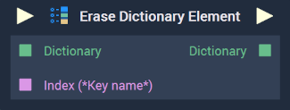
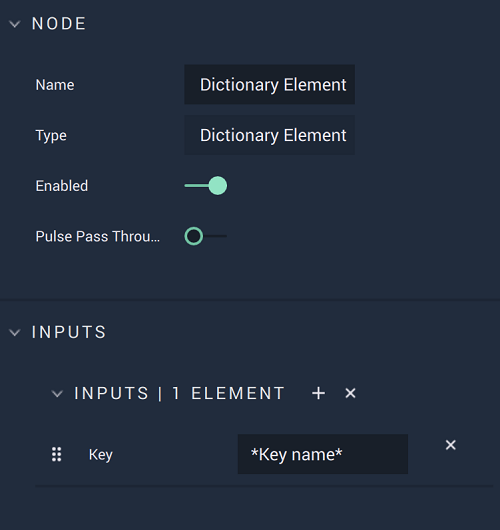

# Erase Dictionary Element

## Overview

The **Erase Dictionary Element Node** removes one or more elements from a **Dictionary**. It receives as input the **Dictionary** from which the element/s will be removed and the `Key/s` of the element/s to erase.

[**Scope**](../overview.md#scopes): **Project**, **Scene**, **Function**, **Prefab**.

## Attributes

### Inputs

`Inputs` - The number of elements you wish to remove from the **Input** **Dictionary**. Each element has the following **Attribute**:

| Attribute | Type | Description |
| :--- | :--- | :--- |
| `Key` | **String** | The `Key` of the element you wish to remove if none is given in the **Input** **Socket**. |

## Inputs

| Input | Type | Description |
| :--- | :--- | :--- |
| _Pulse Input_ \(►\) | **Pulse** | A standard **Input Pulse**, to trigger the execution of the **Node**. |
| `Dictionary` | **Dictionary** | The **Dictionary** whose element/s you wish to remove. |
| `Index (*Key name*)` | **String** | The `Key` of the element you wish to remove. |

## Outputs

| Output | Type | Description |
| :--- | :--- | :--- |
| _Pulse Output_ \(►\) | **Pulse** | A standard **Output Pulse**, to move onto the next **Node** along the **Logic Branch**, once this **Node** has finished its execution. |
| `Dictionary` | **Dictionary** | The resulting **Dictionary** once the desired elements have been removed. |

## See Also

* [**Clear Dictionary**](clear-dictionary.md)
* [**Set Dictionary Element**](set-dictionary-element.md) 

