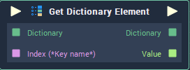

# Get Dictionary Element

## Overview

**Get Dictionary Element** is used for retrieving elements from a **Dictionary**. It receives as input the **Dictionary** from which the elements will be retrieved and the `Keys` of the desired elements. The outputs are the received **Dictionary** and the `Values` associated to the given `Keys`.

## Attributes

### Miscellaneous

`Inputs/Outputs` - The number of elements you want to get from the **Dictionary**. Each element has the following **Attributes**:

| Attribute | Type | Description |
| :--- | :--- | :--- |
| `Key` | **String** | The `Key` of the element you wish to return if none is provided to the `Index` **Input** **Socket** |
| `Data Type` | **Drop Down** | The `Data Type` of the `Value` that will be returned. |

## Inputs

| Input | Type | Description |
| :--- | :--- | :--- |
| _Pulse Input_ \(►\) | **Pulse** | A standard **Input Pulse**, to trigger the execution of the **Node**. |
| `Dictionary` | **Dictionary** | The **Dictionary** from which the desired element/s will be retrieved. |
| `Index (*Key name*)` | **String** | The `Key` of the element you wish to return. |

## Outputs

| Output | Type | Description |
| :--- | :--- | :--- |
| _Pulse Output_ \(►\) | **Pulse** | A standard **Output Pulse**, to move onto the next **Node** along the **Logic Branch**, once this **Node** has finished its execution. |
| `Dictionary` | **Dictionary** | The **Dictionary** provided to the **Input** **Socket** |
| `Value` | _Defined in the_ `Data Type` _**Attribute**_. | The **Output** value retrieved from the **Dictionary**. |

## See Also

* [Dictionary Value](dictionary-value.md)

