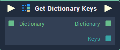

# Get Dictionary Keys

## Overview

The **Get Dictionary Keys** **Node** takes a **Dictionary** as **Input** and yields its set of `Keys` as an **Array**. It also outputs the received **Dictionary**.

## Inputs

| Input | Type | Description |
| :--- | :--- | :--- |
| _Pulse Input_ \(►\) | **Pulse** | A standard **Input Pulse**, to trigger the execution of the **Node**. |
| `Dictionary` | **Dictionary** | The **Dictionary** whose `Keys` you wish to obtain. |

## Outputs

| Output | Type | Description |
| :--- | :--- | :--- |
| _Pulse Output_ \(►\) | **Pulse** | A standard **Output Pulse**, to move onto the next **Node** along the **Logic Branch**, once this **Node** has finished its execution. |
| `Dictionary` | **Dictionary** | The **Dictionary** provided to the **Input** **Socket**. |
| `Keys` | **Array** | An **Array** containing the `Keys` from the given **Dictionary**. |

## See Also

* [**Dictionary Value**](dictionary-value.md)
* [**Set Dictionary Element**](set-dictionary-element.md)

