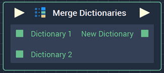
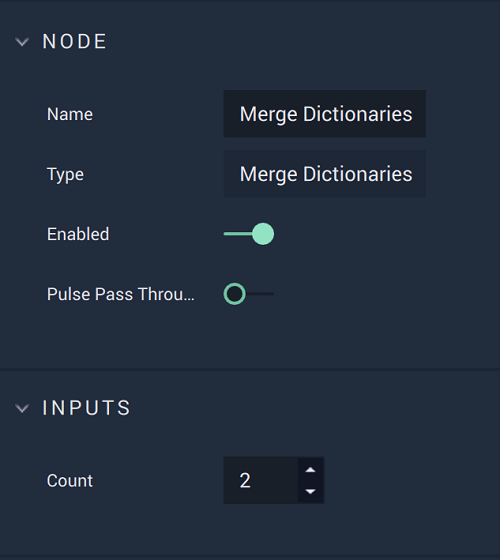

# Merge Dictionaries

## Overview

The **Merge Dictionaries** **Node** merges two or more **Dictionaries**. It receives the **Dictionaries** to merge \(`Dictionary 1`, `Dictionary 2`, etc\) and outputs the merged **Dictionary** \(`New Dictionary`\).

In the case that two or more of the **Dictionaries** to be merged have the same _key_, it takes the _value_ from the first **Dictionary** \(for instance, if `Dictionary 2` and `Dictionary 3` have the same _key_ with different _values_, the `New Dictionary` will take the _value_ from `Dictionary 2`\).

*Scope*: **Project**, **Scene**, **Function**, **Prefab**

## Attributes

### Inputs

| Attribute | Type | Description |
| :--- | :--- | :--- |
| `Count` | **Int** | The number of **Dictionaries** you wish to merge. The default number is 2 **Dictionaries**. |

## Inputs

| Input | Type | Description |
| :--- | :--- | :--- |
| _Pulse Input_ \(►\) | **Pulse** | A standard **Input Pulse**, to trigger the execution of the **Node**. |
| `Dictionary` _\(`Count`  **Attribute**\)_ | **Dictionary** | Two or more **Dictionaries** you wish to merge. |

## Outputs

| Output | Type | Description |
| :--- | :--- | :--- |
| _Pulse Output_ \(►\) | **Pulse** | A standard **Output Pulse**, to move onto the next **Node** along the **Logic Branch**, once this **Node** has finished its execution. |
| `New Dictionary` | **Dictionary** | The merged **Dictionary**. |

## See Also

* [**Dictionary Value**](dictionary-value.md)

