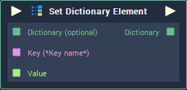

# Set Dictionary Element

## Overview

**Set Dictionary Element** updates element/s in a **Dictionary** to new values. For this, it receives the `Key` of the element to update and the `Value` with which it will be updated.

If the `Key` does not exist in the **Dictionary**, it creates a new \(`Key`, `Value`\) pair.

## Attributes

### Inputs

`Inputs` - The number of elements you wish to set the value of. Each **Input** element has the following **Attributes**:

| Attribute | Type | Description |
| :--- | :--- | :--- |
| `Key` | **String** | The default `Key` of the element you wish to update if no value is provided in the `Key` **Input** **Socket**. |
| `Data Type` | **Drop-down** | The `Data Type` of the `Key` element you wish to update. |
| `Default Value` | _Defined in the_ `Data Type` _**Attribute**_ | The element whose `Key` is specified in the `Key` **Attribute** will be updated with this value. |

## Inputs

| Input | Type | Description |
| :--- | :--- | :--- |
| _Pulse Input_ \(►\) | **Pulse** | A standard **Input Pulse**, to trigger the execution of the **Node**. |
| `Dictionary (optional)` | **Dictionary** | A **Dictionary** whose element/s you wish to update. |
| `Key` | **String** | The `Key` of the element you wish to update. |
| `Value` | _Defined in the_ `Data Type` _**Attribute**_. | The `Value` that will be associated with the `Key` given in the `Key` **Input** **Socket**. |

## Outputs

| Output | Type | Description |
| :--- | :--- | :--- |
| _Pulse Output_ \(►\) | **Pulse** | A standard **Output Pulse**, to move onto the next **Node** along the **Logic Branch**, once this **Node** has finished its execution. |
| `Dictionary` | **Dictionary** | An **Output** **Dictionary** whose element/s have been replaced with the desired values. |

## See Also

* [**Dictionary Value**](dictionary-value.md)

