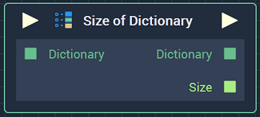

# Size of Dictionary

## Overview

**Size Of Dictionary** returns the total number of elements in a **Dictionary**.

[**Scope**](../overview.md#scopes): **Project**, **Scene**, **Function**, **Prefab**.

## Inputs

| Input | Type | Description |
| :--- | :--- | :--- |
| _Pulse Input_ \(►\) | **Pulse** | A standard **Input Pulse**, to trigger the execution of the **Node**. |
| `Dictionary` | **Dictionary** | The **Dictionary**, whose length you wish to return. |

## Outputs

| Output | Type | Description |
| :--- | :--- | :--- |
| _Pulse Output_ \(►\) | **Pulse** | A standard **Output Pulse**, to move onto the next **Node** along the **Logic Branch**, once this **Node** has finished its execution. |
| `Dictionary` | **Dictionary** | The **Dictionary** supplied to the **Input** **Socket**. |
| `Size` | **Int** | The total number of elements in the **Input** **Dictionary**. |

## See Also

* [**Dictionary Value**](dictionary-value.md) 

