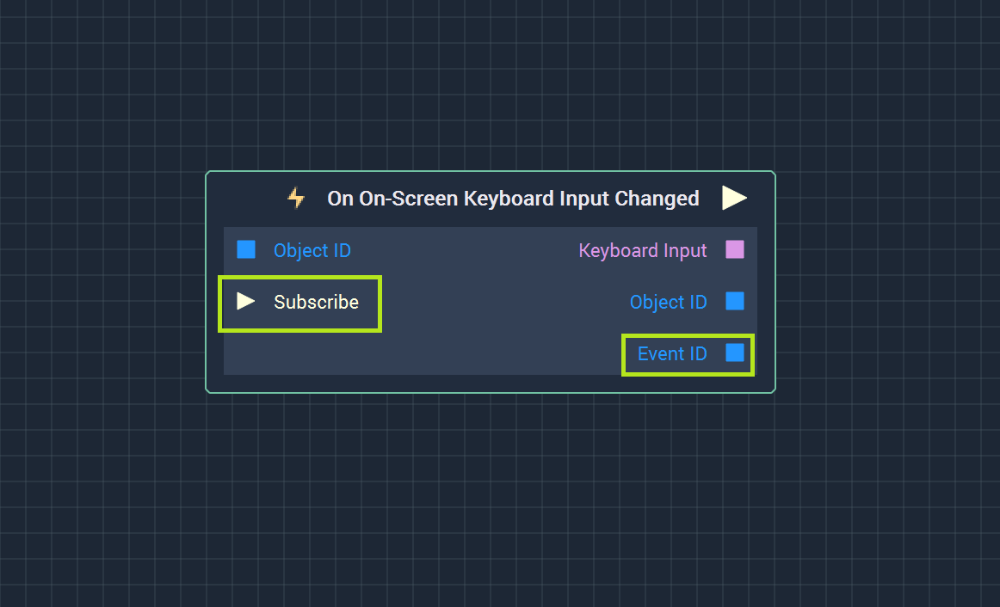
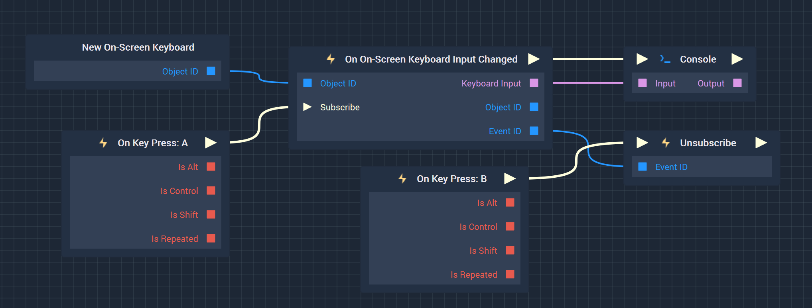

# Events

## Introduction

Although many branches of **Logic** can be defined in **Incari's** **Logic Editor**, a branch will never be executed without being initiated by an **Event**. These **Events** define when, and under what conditions, functionality should be triggered. In both **Incari** and computer science in general, event systems define a relationship between the fulfillment of criteria and the set of instructions to be performed once those criteria are met. They are made up of two parts: _triggers_ and _listeners_.

_Triggers_ can be thought of as being like announcements. A real-world example of a _trigger_ is a school teacher announcing that an exam's time limit has been reached. The other staff members and students are _listeners_ in this case. The **Event** of the teacher's announcement prompts the students to put down their pencils, and staff members to begin collecting exam papers.

**Events** in **Incari** can be directly triggered by the user's input, as is the case with **Keyboard** and **Mouse Events**, or triggered automatically when something happens relating to an **Object**, **Variable**, **Scene**, or **Screen**. One of the most powerful aspects of **Incari's** **Events** is that you can even define your own custom _triggers_ and _listeners_, to establish the criteria under which one part of your **Logic** causes the execution of others.

## Subscribing and Unsubscribing

Many **Event** **Nodes** have an additional `Subscribe` input **Pulse** and all have an `Event ID` output **Socket**.

`Subscribe` is used to start listening to an **Event** when it is triggered by some arbitrary **Node** chosen by the user. This does not apply to **Event Nodes** that subscribe on initialization. 

Once an **Event** is subscribed to, it can be unsubscribed from. This requires the **Event's** *ID*. If you recall, all items in **Incari** have a unique ID. In this case, an **Event ID** is a unique ID to a specific **Event**. This can be attached to the [**Unsubscribe Node**](unsubscribe.md), thus ending a connection to the **Event**. For **Nodes** with a `Subscribe` input, this can create a loop of subscribing and unsubscribing. **Events** that are subscribed to on initialization can only be unsubscribed from once. 

## External Links

[_What is event programming?_](https://mortoray.com/2017/06/26/what-is-event-programming/) on Musing Mortoray.

