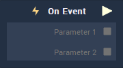

# Overview

**Event Listener** is an **Event Listener** **Node** associated to a **Custom Event** and used for executing a **Logic Branch** when the corresponding **Custom Event Trigger Node** is activated.

# Outputs

|Output|Type|Description|
|---|---|---|
|*Pulse Output* (►)|**Pulse**|A standard **Output Pulse**, to move onto the next **Node** along the **Logic Branch**, once this **Node** has finished its execution.|
|`Parameter [n]`| **Drop-down** | The `Parameter` that was received by the **Trigger Node**. A default value can be set in the **Event** **Attributes**. |

# See Also

* [Custom](README.md)
* [Event Trigger](event-trigger.md)

