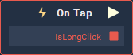

# On Tap

## Overview

**On Tap** is an **Event Listener** **Node** used for executing a **Logic Branch** after a tap on an **Object**.

## Attributes

### Object

| Attribute | Type | Description |
| :--- | :--- | :--- |
| `Object` | **ObjectID** | The **Object** in which a tap triggers the **Logic Branch**. |

### Button

| Attribute | Type | Description |
| :--- | :--- | :--- |
| `Mouse Button` | **Drop-down** | Whether the left, middle, or right button of the mouse will trigger the **Logic**. |

## Outputs

| Output | Type | Description |
| :--- | :--- | :--- |
| _Pulse Output_ \(►\) | **Pulse** | A standard **Output Pulse**, to move onto the next **Node** along the **Logic Branch**, once this **Node** has finished its execution. |
| `IsLongClick` | **Bool** | _True_ when the button is pressed longer than usual. |

## See Also

* [**Gestures**](./)

