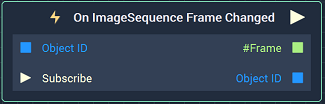
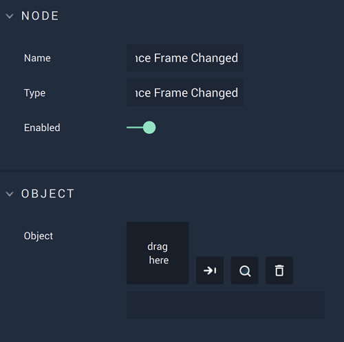

# On ImageSequence Frame Changed

## Overview

**On ImageSequence Frame Changed** is an **Event Listener** **Node** used for executing a **Logic Branch** when the frame of an **Image Sequence** changes.

[**Scope**](../../overview.md#scopes): **Scene**, **Prefab**.

## Attributes

| Attribute | Type | Description |
| :--- | :--- | :--- |
| `Object` | **ObjectID** | **Image Sequence** in which a frame change triggers the **Logic Branch**, if none is given in the `Object ID` **Input Socket**. |

## Inputs

| Input | Type | Description |
| :--- | :--- | :--- |
| `Object ID` | **ObjectID** | **Image Sequence** in which a frame change triggers the **Logic Branch**. |
| `Subscribe` (►)|**Pulse** | An **Input Pulse** that needs to be triggered to start listening to the **Event**. |

## Outputs

| Output | Type | Description |
| :--- | :--- | :--- |
| _Pulse Output_ \(►\) | **Pulse** | A standard **Output Pulse**, to move onto the next **Node** along the **Logic Branch**, once this **Node** has finished its execution. |
| `#Frame` | **Int** | Frame number within the sequence. |
| `Object ID` | **ObjectID** | The **Image Sequence** received as **Input**. | 

## See Also

* [**Image Sequence**](./)

