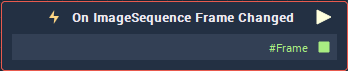

# On ImageSequence Frame Changed

## Overview

**On ImageSequence Frame Changed** is an **Event Listener** **Node** used for executing a **Logic Branch** when the frame of an **Image Sequence** changes.

## Attributes

| Attribute | Type | Description |
| :--- | :--- | :--- |
| `Object` | **ObjectID** | **Image Sequence** in which a frame change triggers the **Logic Branch**. |

## Outputs

| Output | Type | Description |
| :--- | :--- | :--- |
| _Pulse Output_ \(►\) | **Pulse** | A standard **Output Pulse**, to move onto the next **Node** along the **Logic Branch**, once this **Node** has finished its execution. |
| `#Frame` | **Int** | Frame number within the sequence. |

## See Also

* [**Image Sequence**](./)

