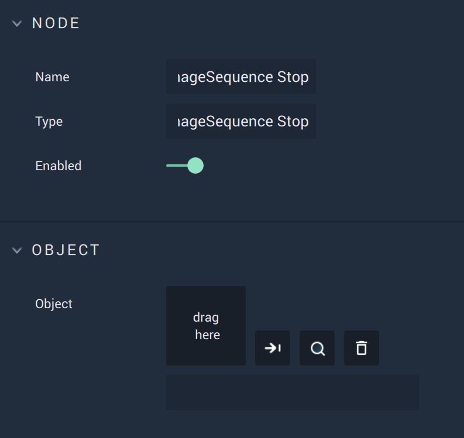

# On ImageSequence Stop

## Overview

**On ImageSequence Stop** is an **Event Listener** **Node** used for executing a **Logic Branch** when an **Image Sequence** is stopped.

[**Scope**](../../overview.md#scopes): **Scene**, **Prefab**.

## Attributes

| Attribute | Type | Description |
| :--- | :--- | :--- |
| `Object` | **ObjectID** | **Image Sequence** that triggers the **Logic Branch** when stopped, if none is given in the `Object ID` **Input Socket**. |

## Inputs

| Input | Type | Description |
| :--- | :--- | :--- |
| `Object ID` | **ObjectID** | **Image Sequence** that triggers the **Logic Branch** when stopped. |
| `Subscribe` (►)|**Pulse** | An **Input Pulse** that needs to be triggered to start listening to the **Event**. |

## Outputs

| Output | Type | Description |
| :--- | :--- | :--- |
| _Pulse Output_ \(►\) | **Pulse** | A standard **Output Pulse**, to move onto the next **Node** along the **Logic Branch**, once this **Node** has finished its execution. |
| `Object ID` | **ObjectID** |  The **Image Sequence** received as **Input**. | 

## See Also

* [**Image Sequence**](./)

