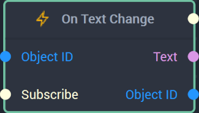

# Overview

The **On Text Change Node** is an **Event Listener** **Node** used for executing a **Logic Branch** when something is entered into a [**Text Input Object**](../../../objects-and-types/scene2d-objects/gui/textinput.md) and returns the inputted text.

[**Scope**](../../overview.md#scopes): **Scene**, **Prefab**.

# Inputs

|Input|Type|Description|
|---|---|---|
|*Pulse Input* (►)|**Pulse**|A standard **Input Pulse**, to trigger the execution of the **Node**.|
|`Object ID`|**ObjectID**|The **Object** in which a text change triggers the **Logic Branch**. |
| `Subscribe` (►)|**Pulse** | An **Input Pulse** that needs to be triggered to start listening to the **Event**. |

# Outputs

|Output|Type|Description|
|---|---|---|
|*Pulse Output* (►)|**Pulse**|A standard **Output Pulse**, to move onto the next **Node** along the **Logic Branch**, once this **Node** has finished its execution.|
|`Text`|**String**|The inputted text.|
|`Object ID`|**ObjectID**| The **Object** received as **Input**. |

