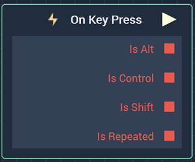
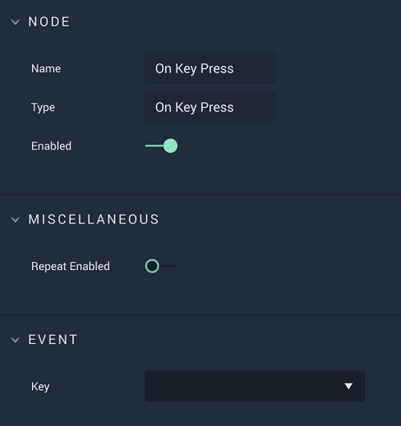

# On Key Press

## Overview

**On Key Press** is an **Event Listener** **Node** used for executing a **Logic Branch** when a key is pressed on a computer keyboard.

[**Scope**](../../overview.md#scopes): **Scene**, **Prefab**.

## Attributes

### Miscellaneous

| Attribute | Type | Description |
| :--- | :--- | :--- |
| `Repeat Enabled` | **Bool** | Whether or not the **Event** is triggered while the key is held down, or just when initially clicked. |

### Event

| Attribute | Type | Description |
| :--- | :--- | :--- |
| `Key` | **Drop-down** | The key that **Incari** will listen to. |

## Outputs

| Output | Type | Description |
| :--- | :--- | :--- |
| _Pulse Output_ \(►\) | **Pulse** | Moves onto the next part of the **Logic** once the assigned key is pressed \(or held\). |
| `Is Alt` | **Bool** | Whether or not the **Alt** key was also pressed in combination with the assigned key. |
| `Is Ctrl` | **Bool** | Whether or not the **Ctrl** key was also pressed in combination with the assigned key. |
| `Is Shift` | **Bool** | Whether or not the **Shift** key was also pressed in combination with the assigned key. |
| `Is Repeated` | **Bool** | Indicates whether this is a repeated/subsequent execution of the **Event** \(`true`\) or the initial time it is executed \(`false`\). If the `Repeat Enabled` **Attribute** is enabled, the output will always be `false` because the **Event** is only executed on the initial press. |

## See Also

* [**Events**](../)
* [**Keyboard**](./)
* [**On Key Release**](on-key-release.md)

