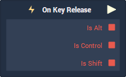

# Overview

**On Key Release** is used for triggering logic when a key is released on a computer keyboard.

# Attributes

|Attribute|Type|Description|
|---|---|---|
|`Key`|**Drop-down**|The key that **INCARI** will *listen* for.|

# Outputs

|Output|Type|Description|
|---|---|---|
|*Pulse Output* (►)|**Pulse**|Moves onto the next part of the **Logic** once the assigned key is released.|
|`Is Alt`|**Bool**|Whether or not the **Alt** key was also pressed when the assigned key was released.|
|`Is Ctrl`|**Bool**|Whether or not the **Ctrl** key was also pressed when the assigned key was released.|
|`Is Shift`|**Bool**|Whether or not the **Shift** key was also pressed when the assigned key was released.|

# See Also
- [**Events**](../README.md)
- [**Keyboard**](README.md)
- [**On Key Press**](on-key-press.md)