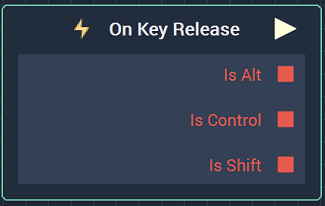
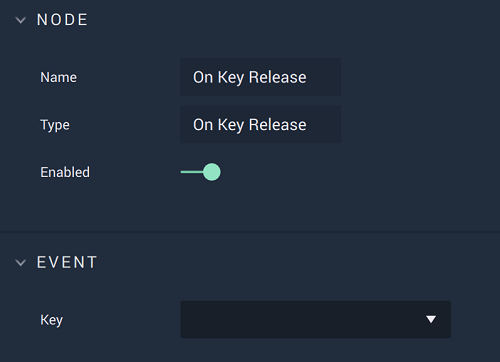

# On Key Release

## Overview

**On Key Release** is an **Event Listener** **Node** used for executing a **Logic Branch** when a key is released on a computer keyboard.

[**Scope**](../../overview.md#scopes): **Scene**, **Prefab**.

## Attributes

### Event

| Attribute | Type | Description |
| :--- | :--- | :--- |
| `Key` | **Drop-down** | The key that **Incari** will listen to. |

## Outputs

| Output | Type | Description |
| :--- | :--- | :--- |
| _Pulse Output_ \(►\) | **Pulse** | Moves onto the next part of the **Logic** once the assigned key is released. |
| `Is Alt` | **Bool** | Whether or not the **Alt** key was also pressed when the assigned key was released. |
| `Is Ctrl` | **Bool** | Whether or not the **Ctrl** key was also pressed when the assigned key was released. |
| `Is Shift` | **Bool** | Whether or not the **Shift** key was also pressed when the assigned key was released. |

## See Also

* [**Events**](../)
* [**Keyboard**](./)
* [**On Key Press**](on-key-press.md)

