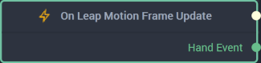

# Overview

**On Leap Motion Frame Update** is an **Event Listener** **Node** used for executing a **Logic Branch** when a *Leap Motion Hand Action* is updated during a *frame*, an interval defined by *Leap Motion*.

[**Scope**](../../overview.md#scopes): **Scene**, **Prefab**.

# Outputs

|Output|Type|Description|
|---|---|---|
|*Pulse Output* (►)|**Pulse**|A standard **Output Pulse**, to move onto the next **Node** along the **Logic Branch**, once this **Node** has finished its execution.|
| `Hand Event` | **Dictionary** |Returns a **Dictionary** of the action's [properties](README.md#properties).  |

