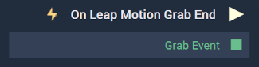

# Overview

**On Leap Motion Grab End** is an **Event Listener** **Node** used for executing a **Logic Branch** when a *Leap Motion Grab Action* ends.

[**Scope**](../../overview.md#scopes): **Scene**, **Prefab**.

# Outputs

|Output|Type|Description|
|---|---|---|
|*Pulse Output* (►)|**Pulse**|A standard **Output Pulse**, to move onto the next **Node** along the **Logic Branch**, once this **Node** has finished its execution.|
| `Grab Event` | **Dictionary** |Returns a **Dictionary** of the action's [properties](README.md#properties).  |

# See Also

* [**On Leap Motion Grab Start**](on-leapmotion-grab-start.md)
* [**On Leap Motion Grab Update**](on-leapmotion-grab-update.md)

