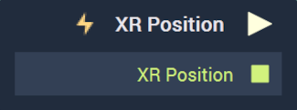

# Overview

The **XR Position Node** returns the position in *3D* space of the tracked entity in some extended reality (*XR*) incorporating *Leap Motion*. This **Node** only has an effect within a **Scene** that is under an [**HMD**](../../../objects-and-types/project-objects/hmd.md). This means that while this **Node** can be placed in a **Scene** under a **Screen**, it will never pulse under these circumstances. 

that the node only makes sense in the logic of a scene that is under an hmd (and not a screen)

If a scene with an XR position node is used with a regular screen, it will never pulse. But it is possible to place, since logic-wise there is no distiction between a scene in a Screen or a scene in a HMD 

[**Scope**](../../overview.md#scopes): **Scene**, **Prefab**.

# Outputs

|Output|Type|Description|
|---|---|---|
|*Pulse Output* (►)|**Pulse**|A standard **Output Pulse**, to move onto the next **Node** along the **Logic Branch**, once this **Node** has finished its execution.|
| `XR Position` | **Vector3** |Returns a 3-dimensional vector containing the $$X$$, $$Y$$, and $$Z$$ values of the current position.|

