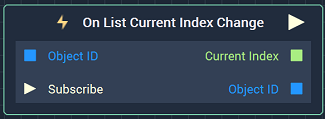
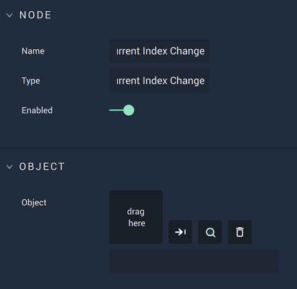

# On List Current Index Change

## Overview

**On List Current Index Change** is an **Event Listener** **Node** used for executing a **Logic Branch** when the current index of a **List** changes.

*Scope*: **Scene**, **Prefab**

## Attributes

| Attribute | Type | Description |
| :--- | :--- | :--- |
| `Object` | **ObjectID** | The **List** in which an index change triggers the **Logic Branch**, if none is given in the `Object ID` **Input Socket**. |

## Inputs

| Input | Type | Description |
| :--- | :--- | :--- |
| `Object ID` | **ObjectID** | The **List** in which an index change triggers the **Logic Branch** |
| `Subscribe` (►)|**Pulse** | An **Input Pulse** that needs to be triggered to start listening to the **Event**. |

## Outputs

| Output | Type | Description |
| :--- | :--- | :--- |
| _Pulse Output_ \(►\) | **Pulse** | A standard **Output Pulse**, to move onto the next **Node** along the **Logic Branch**, once this **Node** has finished its execution. |
| `Current Index` | **Int** | The current index of the **List**. |
| `Object ID` | **ObjectID** | The **List** received as **Input**. |

## See Also

* [**List Events**](./)
* [**List Object**](../../../objects-and-types/scene-objects/list-widget.md)

