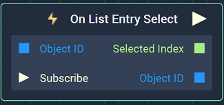
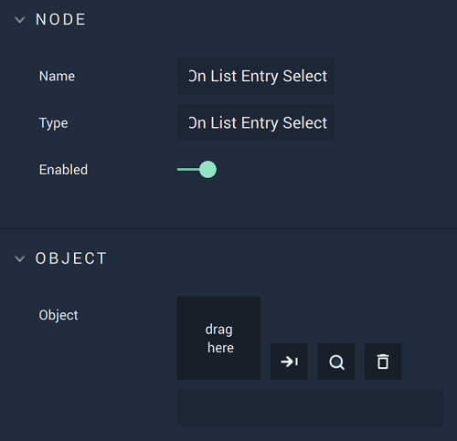

# On List Entry Select

## Overview

**On List Entry Select** is an **Event Listener** **Node** used for executing a **Logic Branch** when an entry of a **List** is selected.

[**Scope**](../../overview.md#scopes): **Scene**, **Prefab**.

## Attributes

| Attribute | Type | Description |
| :--- | :--- | :--- |
| `Object` | **ObjectID** | The **List** whose entry selection triggers the **Logic Branch**, if none is given in the `Object ID` **Input Socket**. |

## Inputs

| Input | Type | Description |
| :--- | :--- | :--- |
| `Object ID` | **ObjectID** | The **List** whose entry selection triggers the **Logic Branch**. |
| `Subscribe` (►)|**Pulse** | An **Input Pulse** that needs to be triggered to start listening to the **Event**. |

## Outputs

| Output | Type | Description |
| :--- | :--- | :--- |
| _Pulse Output_ \(►\) | **Pulse** | A standard **Output Pulse**, to move onto the next **Node** along the **Logic Branch**, once this **Node** has finished its execution. |
| `Selected Index` | **Int** | The index of the selected entry in the **List**. |
| `Object ID` | **Object ID** | The **List** received as **Input**. |

## See Also

* [**List Events**](./)
* [**List Object**](../../../objects-and-types/scene-objects/list-widget.md)

