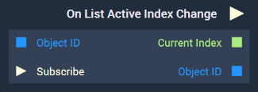

# Overview

The **On List Active Index Change** is an **Event Listener** **Node** used for executing a **Logic Branch** when a **List's** `Active Index` changes.

The `Active Index` of a [**List**](../../../objects-and-types/scene2d-objects/gui/list.md) is the place of the active item in its order. Indexing starts at 0, so if the very first element of the **List** is the active item, the `Active Index` would be 0. 

[**Scope**](../../overview.md#scopes): **Scene**, **Prefab**.

# Inputs

|Input|Type|Description|
|---|---|---|
|*Pulse Input* (►)|**Pulse**|A standard **Input Pulse**, to trigger the execution of the **Node**.|
|`Object ID`|**ObjectID**|The **Object** in which an `Active Index` change triggers the **Logic Branch**.|
| `Subscribe` (►)|**Pulse** | An **Input Pulse** that needs to be triggered to start listening to the **Event**. |

# Outputs

|Output|Type|Description|
|---|---|---|
|*Pulse Output* (►)|**Pulse**|A standard **Output Pulse**, to move onto the next **Node** along the **Logic Branch**, once this **Node** has finished its execution.|
|`Current Index`|**Int**|The current `Active Index`.|
|`Object ID`|**ObjectID**| The **Object** received as **Input**. |

