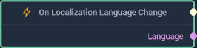

# Overview

**On Localization Language Change Node** is an **Event Listener** **Node** used for executing a **Logic Branch** when there is a change in the current language. It also outputs the new current language. 

[**Scope**](../../overview.md#scopes): **Scene**, **Prefab**.

# Inputs

|Input|Type|Description|
|---|---|---|
|*Pulse Input* (►)|**Pulse**|A standard **Input Pulse**, to trigger the execution of the **Node**.|

# Outputs

|Output|Type|Description|
|---|---|---|
|*Pulse Output* (►)|**Pulse**|A standard **Output Pulse**, to move onto the next **Node** along the **Logic Branch**, once this **Node** has finished its execution.|
|`Language`|**String**|The current language on execution of the **Node**.|

# See Also

* [**Localization**](../../../modules/project-settings/localization.md)
* [**Localiztion Nodes**](../../localization/README.md)

