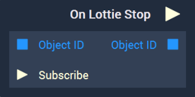

# Overview

**On Lottie Stop** is an **Event Listener** **Node** used for executing a **Logic Branch** when a *lottie* is stopped.

Note that this **Node** gets triggered when a *lottie* animation is forced to stop. For executing a **Logic Branch** when a *lottie* animation finishes, use [**On Lottie Finish**](on-lottie-finish.md).

[**Scope**](../../overview.md#scopes): **Scene**, **Prefab**.

# Inputs

|Input|Type|Description|
|---|---|---|
|*Pulse Input* (►)|**Pulse**|A standard **Input Pulse**, to trigger the execution of the **Node**.|
| `Object ID` | **ObjectID** | **Lottie Sprite** that triggers the **Logic Branch** when stopped. |
| `Subscribe` (►)|**Pulse** | An **Input Pulse** that needs to be triggered to start listening to the **Event**. |

# Outputs

|Output|Type|Description|
|---|---|---|
|*Pulse Output* (►)|**Pulse**|A standard **Output Pulse**, to move onto the next **Node** along the **Logic Branch**, once this **Node** has finished its execution.|
| `Object ID` | **ObjectID** | The **Lottie Sprite** received as **Input**. | 

# See Also

* [**Lottie Sprite**](../../../objects-and-types/scene-objects/lottie-sprite.md)
* [**Stop Lottie**](../../incari/lottie/stop-lottie.md)

# External Links

* [What is a Lottie?](https://lottiefiles.com/what-is-lottie) on LottieFiles.
