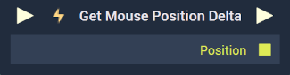

# Overview

The **Get Mouse Position Delta Node** returns the difference between the current X and Y coordinates and the previous X and Y coordinates of the mouse's position in the **Incari Player**. It also takes into account the speed of the change in the mouse's position. 

# Inputs

|Input|Type|Description|
|---|---|---|
|*Pulse Input* (►)|**Pulse**|A standard **Input Pulse**, to trigger the execution of the **Node**.|

# Outputs

|Output|Type|Description|
|---|---|---|
|*Pulse Output* (►)|**Pulse**|A standard **Output Pulse**, to move onto the next **Node** along the **Logic Branch**, once this **Node** has finished its execution.|
|`Position`|**Vector2**|The difference between the X and Y coordinates of the mouse's current position and its previous one. It also includes in its calculation the speed of this change.|

# See Also

* [Get Mouse Position](getmouseposition.md)